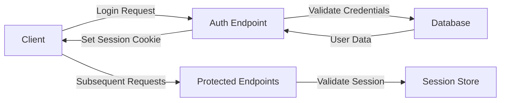

# ContraMind API Documentation

## Table of Contents
- [Overview](#overview)
- [Authentication](#authentication)
- [Endpoints](#endpoints)
- [Data Structures](#data-structures)
- [Error Handling](#error-handling)
- [Rate Limiting](#rate-limiting)

---

## Overview

The ContraMind API is a RESTful service that powers the contract analysis platform. All endpoints return JSON responses and require authentication unless specified otherwise.

### Base URL
```
Development: http://localhost:5000/api
Production: https://api.contramind.ai
```

### Headers
```http
Content-Type: application/json
Authorization: Bearer <session-token>
```

---

## Authentication

### Session Management
ContraMind uses session-based authentication with secure HTTP-only cookies.



---

## Endpoints

### Authentication Endpoints

#### POST /api/auth/signup
Create a new user account.

**Request Body:**
```json
{
  "email": "user@example.com",
  "password": "SecurePassword123!",
  "name": "John Doe"
}
```

**Response:**
```json
{
  "success": true,
  "user": {
    "id": "uuid",
    "email": "user@example.com",
    "name": "John Doe",
    "tokens": 1000
  }
}
```

#### POST /api/auth/login
Authenticate a user.

**Request Body:**
```json
{
  "email": "user@example.com",
  "password": "SecurePassword123!"
}
```

**Response:**
```json
{
  "success": true,
  "user": {
    "id": "uuid",
    "email": "user@example.com",
    "name": "John Doe",
    "tokens": 950
  }
}
```

#### GET /api/auth/google
Initiate Google OAuth flow.

#### GET /api/auth/microsoft
Initiate Microsoft OAuth flow.

#### POST /api/auth/logout
End user session.

**Response:**
```json
{
  "success": true,
  "message": "Logged out successfully"
}
```

---

### Contract Management

#### POST /api/contracts/upload
Upload and analyze a contract.

**Request:**
- Method: POST
- Content-Type: multipart/form-data
- Token Cost: 10 tokens

**Form Data:**
```
file: <contract-file>
party: "client" | "vendor" | "neutral"
```

**Response:**
```json
{
  "success": true,
  "contract": {
    "id": "uuid",
    "filename": "contract.pdf",
    "uploadDate": "2025-01-27T10:00:00Z",
    "party": "client",
    "analysis": {
      "contractType": "Service Agreement",
      "parties": ["Company A", "Company B"],
      "startDate": "2025-02-01",
      "endDate": "2026-01-31",
      "riskLevel": "medium",
      "riskFactors": [
        "Unlimited liability clause",
        "No termination clause"
      ],
      "keyInsights": [
        "Payment terms: Net 30",
        "Renewal: Automatic"
      ]
    }
  }
}
```

#### GET /api/contracts
Get user's contracts.

**Query Parameters:**
- `limit` (optional): Number of contracts to return (default: 10)
- `offset` (optional): Pagination offset (default: 0)
- `riskLevel` (optional): Filter by risk level

**Response:**
```json
{
  "success": true,
  "contracts": [
    {
      "id": "uuid",
      "filename": "contract.pdf",
      "uploadDate": "2025-01-27T10:00:00Z",
      "riskLevel": "high",
      "contractType": "Service Agreement"
    }
  ],
  "total": 25,
  "hasMore": true
}
```

#### GET /api/contracts/:id
Get specific contract details.

**Response:**
```json
{
  "success": true,
  "contract": {
    "id": "uuid",
    "filename": "contract.pdf",
    "uploadDate": "2025-01-27T10:00:00Z",
    "party": "client",
    "analysis": { /* Full analysis data */ },
    "chatHistory": [ /* Chat messages */ ]
  }
}
```

---

### Chat Interface

#### POST /api/contracts/:id/chat
Send a message about a contract.

**Request Body:**
```json
{
  "message": "Can you explain the termination clause?"
}
```

**Token Cost:** 5 tokens per message

**Response:**
```json
{
  "success": true,
  "response": {
    "id": "msg-uuid",
    "message": "The termination clause in this contract states...",
    "timestamp": "2025-01-27T10:05:00Z",
    "tokensUsed": 5
  },
  "remainingTokens": 940
}
```

#### GET /api/contracts/:id/chat
Get chat history for a contract.

**Response:**
```json
{
  "success": true,
  "messages": [
    {
      "id": "msg-uuid",
      "role": "user",
      "message": "What are the payment terms?",
      "timestamp": "2025-01-27T10:00:00Z"
    },
    {
      "id": "msg-uuid-2",
      "role": "assistant",
      "message": "The payment terms are Net 30...",
      "timestamp": "2025-01-27T10:00:05Z"
    }
  ]
}
```

---

### Analytics

#### GET /api/analytics/dashboard
Get dashboard statistics.

**Response:**
```json
{
  "success": true,
  "analytics": {
    "totalContracts": 45,
    "riskDistribution": {
      "high": 5,
      "medium": 15,
      "low": 25
    },
    "contractTypes": {
      "Service Agreement": 20,
      "NDA": 15,
      "Employment": 10
    },
    "recentActivity": [
      {
        "contractId": "uuid",
        "filename": "contract.pdf",
        "action": "uploaded",
        "timestamp": "2025-01-27T10:00:00Z"
      }
    ]
  }
}
```

---

### User Management

#### GET /api/user/profile
Get current user profile.

**Response:**
```json
{
  "success": true,
  "user": {
    "id": "uuid",
    "email": "user@example.com",
    "name": "John Doe",
    "tokens": 940,
    "createdAt": "2025-01-01T00:00:00Z",
    "preferences": {
      "language": "en",
      "theme": "light",
      "notifications": true
    }
  }
}
```

#### PATCH /api/user/profile
Update user profile.

**Request Body:**
```json
{
  "name": "Jane Doe",
  "preferences": {
    "language": "ar",
    "theme": "dark"
  }
}
```

---

## Data Structures

### Contract Analysis Object
```typescript
interface ContractAnalysis {
  contractType: string;
  parties: string[];
  startDate: string;
  endDate: string;
  value?: number;
  currency?: string;
  riskLevel: 'high' | 'medium' | 'low';
  riskFactors: string[];
  keyInsights: string[];
  obligations: {
    party: string;
    description: string;
    deadline?: string;
  }[];
  paymentTerms?: {
    schedule: string;
    method: string;
    penalties?: string;
  };
}
```

### Chat Message Object
```typescript
interface ChatMessage {
  id: string;
  contractId: string;
  role: 'user' | 'assistant';
  message: string;
  timestamp: string;
  tokensUsed?: number;
}
```

### User Object
```typescript
interface User {
  id: string;
  email: string;
  name: string;
  tokens: number;
  createdAt: string;
  preferences: {
    language: 'en' | 'ar';
    theme: 'light' | 'dark';
    notifications: boolean;
  };
}
```

---

## Error Handling

### Error Response Format
```json
{
  "success": false,
  "error": {
    "code": "ERROR_CODE",
    "message": "Human-readable error message",
    "details": {}
  }
}
```

### Common Error Codes
| Code | HTTP Status | Description |
|------|-------------|-------------|
| `AUTH_REQUIRED` | 401 | Authentication required |
| `INVALID_CREDENTIALS` | 401 | Invalid email or password |
| `INSUFFICIENT_TOKENS` | 402 | Not enough tokens |
| `NOT_FOUND` | 404 | Resource not found |
| `VALIDATION_ERROR` | 400 | Invalid request data |
| `FILE_TOO_LARGE` | 413 | File exceeds size limit |
| `UNSUPPORTED_FORMAT` | 415 | File format not supported |
| `RATE_LIMIT_EXCEEDED` | 429 | Too many requests |
| `SERVER_ERROR` | 500 | Internal server error |

---

## Rate Limiting

### Limits
- Authentication endpoints: 5 requests per minute
- Upload endpoint: 10 requests per hour
- Chat endpoint: 30 requests per minute
- Other endpoints: 60 requests per minute

### Rate Limit Headers
```http
X-RateLimit-Limit: 60
X-RateLimit-Remaining: 45
X-RateLimit-Reset: 1643723400
```

---

## WebSocket Events

### Connection
```javascript
const ws = new WebSocket('wss://api.contramind.ai/ws');
ws.on('open', () => {
  ws.send(JSON.stringify({
    type: 'auth',
    token: sessionToken
  }));
});
```

### Event Types

#### Contract Analysis Update
```json
{
  "type": "analysis_update",
  "contractId": "uuid",
  "status": "processing" | "completed" | "failed",
  "progress": 75
}
```

#### Real-time Analytics
```json
{
  "type": "analytics_update",
  "data": {
    "totalContracts": 46,
    "latestContract": {
      "id": "uuid",
      "filename": "new-contract.pdf"
    }
  }
}
```

---

<div align="center">
  <p>API Version: 1.0 | Last updated: January 2025</p>
</div>