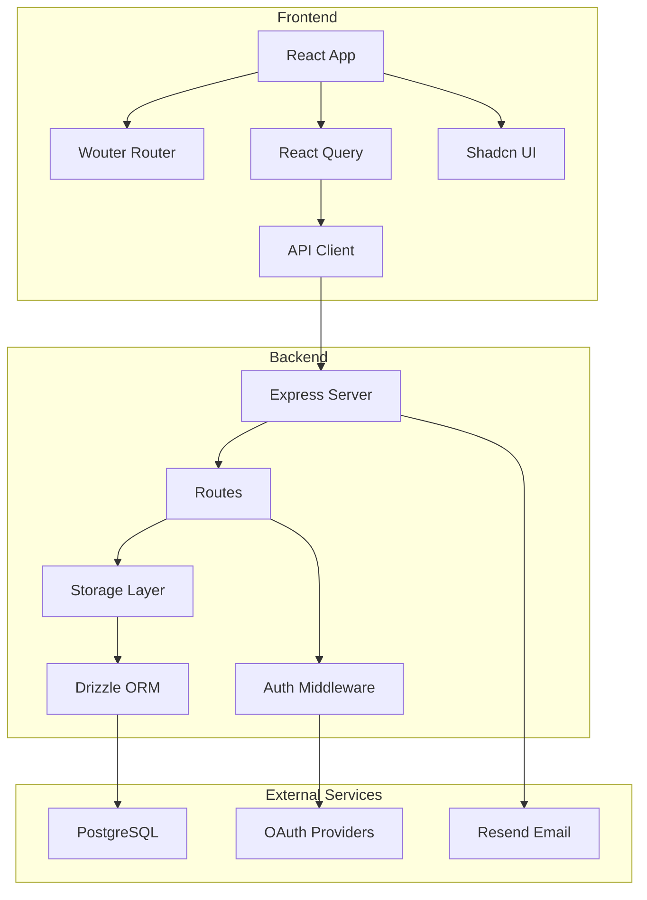

# ContraMind Developer Guide

## Table of Contents
- [Project Structure](#project-structure)
- [Development Setup](#development-setup)
- [Architecture Overview](#architecture-overview)
- [Component Hierarchy](#component-hierarchy)
- [State Management](#state-management)
- [Database Schema](#database-schema)
- [Adding New Features](#adding-new-features)
- [Testing](#testing)
- [Deployment](#deployment)
- [Code Standards](#code-standards)

---

## Project Structure

```
contramind/
├── client/                    # Frontend React application
│   ├── public/               # Static assets
│   ├── src/
│   │   ├── components/       # React components
│   │   │   ├── ui/          # Shadcn UI components
│   │   │   └── ...          # Feature components
│   │   ├── hooks/           # Custom React hooks
│   │   ├── lib/             # Utilities and helpers
│   │   ├── pages/           # Page components
│   │   ├── App.tsx          # Main app component
│   │   └── main.tsx         # Entry point
│   └── index.html
├── server/                   # Backend Express application
│   ├── routes.ts            # API route definitions
│   ├── storage.ts           # Database interface
│   ├── auth.ts              # Authentication logic
│   ├── contractExtractor.ts # Contract processing
│   └── index.ts             # Server entry point
├── shared/                   # Shared types and schemas
│   └── schema.ts            # Database schemas
├── docs/                     # Documentation
├── attached_assets/          # User uploaded assets
├── package.json             # Dependencies
├── vite.config.ts           # Vite configuration
├── drizzle.config.ts        # Database configuration
├── tailwind.config.ts       # Tailwind CSS config
└── tsconfig.json            # TypeScript config
```

---

## Development Setup

### Prerequisites
```bash
# Required versions
Node.js >= 20.x
PostgreSQL >= 16.x
npm >= 10.x
```

### Initial Setup
```bash
# Clone repository
git clone https://github.com/yourusername/contramind.git
cd contramind

# Install dependencies
npm install

# Setup environment variables
cp .env.example .env
# Edit .env with your configuration

# Setup database
npm run db:push

# Start development server
npm run dev
```

### Development Commands
```json
{
  "scripts": {
    "dev": "Starts both frontend and backend",
    "build": "Production build",
    "db:push": "Push schema changes to database",
    "db:studio": "Open Drizzle Studio",
    "typecheck": "Run TypeScript checks",
    "lint": "Run ESLint",
    "format": "Format code with Prettier"
  }
}
```

---

## Architecture Overview

### System Architecture Diagram


### Key Design Decisions

#### Frontend Architecture
- **React 18.3** with TypeScript for type safety
- **Wouter** for lightweight client-side routing
- **React Query** for server state management
- **Tailwind CSS** for utility-first styling
- **Shadcn UI** for accessible component library
- **Framer Motion** for animations

#### Backend Architecture
- **Express.js** for REST API
- **Drizzle ORM** for type-safe database queries
- **Passport.js** for authentication strategies
- **Session-based** auth with secure cookies
- **Custom extraction pipeline** for document processing

---

## Component Hierarchy

### Main Application Structure
```
App.tsx
├── SimpleLanguageProvider
├── TooltipProvider
├── QueryClientProvider
│   └── Router
│       ├── Layout
│       │   ├── Header
│       │   ├── Sidebar
│       │   └── Content
│       └── Routes
│           ├── Dashboard
│           ├── Chat
│           ├── Settings
│           └── Auth Pages
```

### Key Components

#### Dashboard Components
```typescript
// client/src/pages/Dashboard.tsx
Dashboard
├── StatCard (Total Contracts, Risk Levels)
├── RiskDistributionChart
├── ContractTypesChart
└── RecentActivity
```

#### Chat Interface
```typescript
// client/src/pages/Chat.tsx
Chat
├── ContractUpload
│   ├── PartySelector
│   └── FileDropzone
├── ChatMessages
│   ├── UserMessage
│   └── AssistantMessage
└── ChatInput
```

#### Authentication Flow
```typescript
// client/src/pages/auth/
AuthLayout
├── Login
│   ├── EmailPasswordForm
│   └── SocialLogins
├── Signup
│   ├── RegistrationForm
│   └── EmailVerification
└── ForgotPassword
```

---

## State Management

### Global State with React Query

```typescript
// Query Keys Convention
const queryKeys = {
  user: ['user'],
  contracts: ['contracts'],
  contract: (id: string) => ['contracts', id],
  analytics: ['analytics'],
  chat: (contractId: string) => ['chat', contractId]
};

// Example Query Hook
export function useContracts() {
  return useQuery({
    queryKey: queryKeys.contracts,
    queryFn: () => apiRequest('/api/contracts'),
    staleTime: 5 * 60 * 1000, // 5 minutes
  });
}

// Example Mutation Hook
export function useUploadContract() {
  const queryClient = useQueryClient();
  
  return useMutation({
    mutationFn: (data: FormData) => 
      apiRequest('/api/contracts/upload', {
        method: 'POST',
        body: data
      }),
    onSuccess: () => {
      queryClient.invalidateQueries({ 
        queryKey: queryKeys.contracts 
      });
    }
  });
}
```

### Local State Management
- Component state with `useState`
- Form state with `react-hook-form`
- Theme state with Context API
- Language state with custom provider

---

## Database Schema

### Core Tables

```typescript
// Users Table
export const users = pgTable('users', {
  id: uuid('id').primaryKey().defaultRandom(),
  email: text('email').notNull().unique(),
  password: text('password'),
  name: text('name').notNull(),
  tokens: integer('tokens').notNull().default(1000),
  emailVerified: boolean('email_verified').default(false),
  createdAt: timestamp('created_at').defaultNow(),
  preferences: jsonb('preferences').$type<UserPreferences>()
});

// Contracts Table
export const contracts = pgTable('contracts', {
  id: uuid('id').primaryKey().defaultRandom(),
  userId: uuid('user_id').references(() => users.id),
  filename: text('filename').notNull(),
  party: text('party').notNull(), // client, vendor, neutral
  uploadDate: timestamp('upload_date').defaultNow(),
  fileData: bytea('file_data'),
  analysis: jsonb('analysis').$type<ContractAnalysis>()
});

// Contract Details Table
export const contractDetails = pgTable('contract_details', {
  id: uuid('id').primaryKey().defaultRandom(),
  contractId: uuid('contract_id').references(() => contracts.id),
  contractType: text('contract_type'),
  parties: text('parties').array(),
  startDate: date('start_date'),
  endDate: date('end_date'),
  riskLevel: text('risk_level'),
  riskFactors: text('risk_factors').array(),
  keyInsights: jsonb('key_insights')
});

// Chat Messages Table
export const contractChats = pgTable('contract_chats', {
  id: uuid('id').primaryKey().defaultRandom(),
  contractId: uuid('contract_id').references(() => contracts.id),
  role: text('role').notNull(), // user, assistant
  message: text('message').notNull(),
  timestamp: timestamp('timestamp').defaultNow(),
  tokensUsed: integer('tokens_used')
});
```

### Database Migrations
```bash
# Push schema changes (development)
npm run db:push

# Generate migration files (production)
npm run db:generate

# Run migrations
npm run db:migrate
```

---

## Adding New Features

### Feature Development Workflow

#### 1. Define Data Model
```typescript
// shared/schema.ts
export const newFeature = pgTable('new_feature', {
  id: uuid('id').primaryKey().defaultRandom(),
  // Add fields
});

// Create schemas
export const insertNewFeatureSchema = createInsertSchema(newFeature);
export type InsertNewFeature = z.infer<typeof insertNewFeatureSchema>;
export type SelectNewFeature = typeof newFeature.$inferSelect;
```

#### 2. Update Storage Interface
```typescript
// server/storage.ts
interface IStorage {
  // Existing methods...
  
  // New feature methods
  createNewFeature(data: InsertNewFeature): Promise<SelectNewFeature>;
  getNewFeatures(userId: string): Promise<SelectNewFeature[]>;
}
```

#### 3. Implement API Routes
```typescript
// server/routes.ts
router.post('/api/new-feature', authenticate, async (req, res) => {
  try {
    const validated = insertNewFeatureSchema.parse(req.body);
    const result = await storage.createNewFeature(validated);
    res.json({ success: true, data: result });
  } catch (error) {
    handleError(error, res);
  }
});
```

#### 4. Create Frontend Components
```typescript
// client/src/components/NewFeature.tsx
export function NewFeature() {
  const { data, isLoading } = useQuery({
    queryKey: ['new-feature'],
    queryFn: () => apiRequest('/api/new-feature')
  });
  
  // Component implementation
}
```

#### 5. Add to Router
```typescript
// client/src/App.tsx
<Route path="/new-feature" component={NewFeature} />
```

---

## Testing

### Unit Testing
```typescript
// Example test file
// tests/contractExtractor.test.ts
import { extractContractData } from '../server/contractExtractor';

describe('Contract Extractor', () => {
  it('should extract party names from PDF', async () => {
    const result = await extractContractData(testPDF);
    expect(result.parties).toHaveLength(2);
  });
});
```

### Integration Testing
```typescript
// tests/api.test.ts
describe('API Endpoints', () => {
  it('should upload contract successfully', async () => {
    const response = await request(app)
      .post('/api/contracts/upload')
      .attach('file', 'test-contract.pdf')
      .field('party', 'client');
      
    expect(response.status).toBe(200);
    expect(response.body.success).toBe(true);
  });
});
```

### E2E Testing
```typescript
// tests/e2e/contract-flow.test.ts
test('complete contract analysis flow', async ({ page }) => {
  await page.goto('/');
  await page.click('text=Login');
  // ... complete flow test
});
```

---

## Deployment

### Production Build
```bash
# Build frontend and backend
npm run build

# Output structure
dist/
├── client/          # Vite build output
└── server/          # TypeScript compiled output
```

### Environment Configuration
```env
# Production .env
NODE_ENV=production
DATABASE_URL=postgresql://prod-connection
SESSION_SECRET=strong-secret-key
GOOGLE_CLIENT_ID=prod-client-id
GOOGLE_CLIENT_SECRET=prod-client-secret
RESEND_API_KEY=prod-api-key
```

### Deployment Checklist
- [ ] Update environment variables
- [ ] Run database migrations
- [ ] Build production assets
- [ ] Configure SSL certificates
- [ ] Setup monitoring
- [ ] Configure backup strategy
- [ ] Update DNS records
- [ ] Test OAuth redirects

### Docker Deployment
```dockerfile
# Dockerfile
FROM node:20-alpine
WORKDIR /app
COPY package*.json ./
RUN npm ci --production
COPY . .
RUN npm run build
EXPOSE 5000
CMD ["npm", "start"]
```

---

## Code Standards

### TypeScript Guidelines
```typescript
// Use explicit types
interface UserData {
  id: string;
  email: string;
  name: string;
}

// Avoid any
function processUser(user: UserData): void {
  // Implementation
}

// Use enums for constants
enum RiskLevel {
  LOW = 'low',
  MEDIUM = 'medium',
  HIGH = 'high'
}
```

### React Best Practices
```typescript
// Use functional components
export function Component({ prop }: Props) {
  // Use hooks
  const [state, setState] = useState<string>('');
  
  // Memoize expensive computations
  const computed = useMemo(() => {
    return expensiveOperation(state);
  }, [state]);
  
  return <div>{computed}</div>;
}
```

### API Design
```typescript
// RESTful naming
GET    /api/contracts      // List
GET    /api/contracts/:id  // Get one
POST   /api/contracts      // Create
PATCH  /api/contracts/:id  // Update
DELETE /api/contracts/:id  // Delete

// Consistent response format
{
  success: boolean;
  data?: any;
  error?: {
    code: string;
    message: string;
  };
}
```

### Git Workflow
```bash
# Branch naming
feature/contract-export
bugfix/token-calculation
hotfix/auth-redirect

# Commit messages
feat: add contract export functionality
fix: correct token deduction logic
docs: update API documentation
refactor: simplify chat component
```

---

## Performance Optimization

### Frontend Optimization
- Code splitting with React.lazy
- Image optimization with WebP
- Bundle size monitoring
- Lighthouse performance audits

### Backend Optimization
- Database query optimization
- Redis caching for sessions
- Rate limiting
- Request compression

### Monitoring
- Error tracking with Sentry
- Performance monitoring
- User analytics
- Uptime monitoring

---

<div align="center">
  <p>For additional help, contact the development team</p>
  <p>Last updated: January 2025</p>
</div>